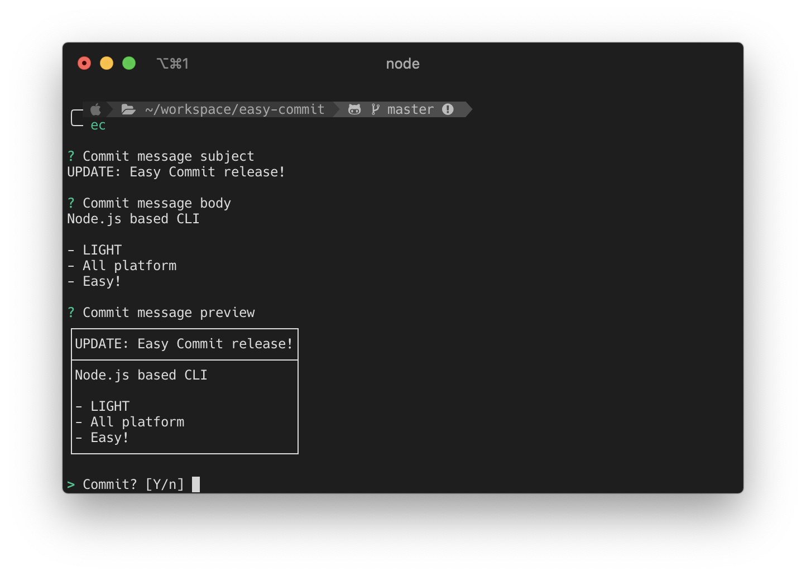

# Easy Commit
> ✉️ Git Commit Message Helper

[](https://www.npmjs.com/package/easy-commit)
[](https://www.npmjs.com/package/easy-commit)
[](https://www.npmjs.com/package/easy-commit)



## Install

- Require
  - Node.js `>=10.3.0`
  - Git

```bash
npm install -g easy-commit
```

## Usage

Just enter `ec` command.

```bash
ec
```

- Type commit message subject
- Type commit message body (optional)
- `Ctrl + C` to confirm & commit!

## Changelog

- `0.1.2`
  - FIXED: Multibyte character length checking
- `0.1.1`
  - FIXED: ANSI Color padding (Message preview)
- `0.1.0`
  - **Change version convention**
  - FIXED: Crash when press `Ctrl + C` without subject
- `0.0.1`
  - First release.

## LICENSE

[MIT](./LICENSE)
